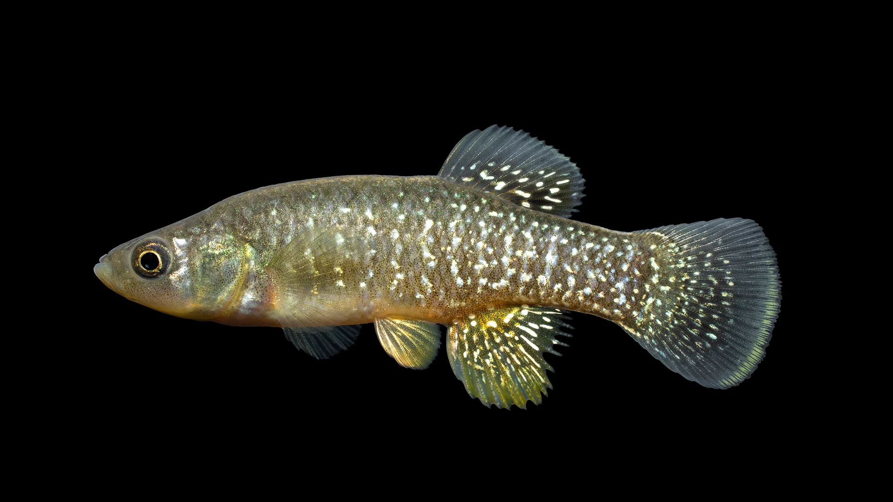
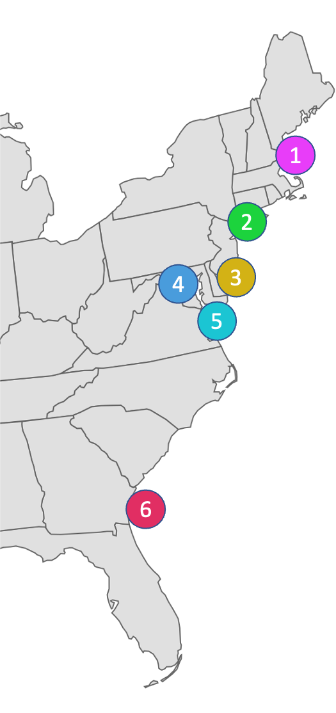

```{r setup, include=FALSE}
knitr::opts_chunk$set(echo = TRUE)
#knitr::opts_knit$set(root.dir = "~/Documents/GEOMAR/Teaching/Mar_pop_gen/structure")
```

<center>
{width=400px}
</center>

Here is the killifish, Fundulus heteroclitus. This is a small marsh species that is one of the most abundant species in estuaries along the east coast of the United States. Their common name is mud minnow or Mummichog, which means something along the lines of "going in crowds". Despite being small (<10 cm), they're super tough and tolerate all type of temperatures, salinity, hypoxia, pollution, and so on. They're also cool because they don't really move much. An average individual won't leave its marsh during its lifetime. This means there should be lots of populations structure!

In this exercise you're going to look at two common ways of assessing population structure: Principle components analysis and Structure. You'll use RADseq data from 6 populations of F. heteroclitus. You'll be using data from ~15,000 SNPs. 

<center>
{width=300px}
</center>

### PCA

You can find the file for this next section here:
 
 - `https://raw.githubusercontent.com/rsbrennan/EvolutionaryGenomics/master/Exercises/data/fheteroclitus_coastal.pops.stru`


```{r eval=F}
library(pophelper)
library(gridExtra)
library(ggplot2)
library(adegenet)
library(hierfstat)

###################
# PCA
###################

# read in from structure format
# It isn't that typical to use structure format for something like this. I'm doing it so you have the structure file in case you want to run structure on your own. 

# the following will make a genind object using adegenet 
obj <- read.structure("PATH TO .stru FILE",
                      n.ind=239, # the number of individuals 
                      n.loc= 15542, # the number of loci
                      onerowperind = TRUE,
                      col.lab = 1, # individual labels are in the first column
                      col.pop = 2, # population labels in the 2nd column
                      row.marknames=1, # loci names are the first row
                      col.others=FALSE,
                      NA.char = "0") # missing genotypes are specified with 0.

# add the population id's to the 
pop(obj) <- substr(indNames(obj), 1,2)
# replace the population names with the corresponding numbers from the map. Just to make it easier to interpret
pop(obj)<- gsub("TR", "1",pop(obj))
pop(obj)<- gsub("PC", "2",pop(obj))
pop(obj)<- gsub("HP", "3",pop(obj))
pop(obj)<- gsub("PP", "4",pop(obj))
pop(obj)<- gsub("PL", "5",pop(obj))
pop(obj)<- gsub("GA", "6",pop(obj))

# generate the allele frequency table
x.af <- tab(obj, freq=TRUE, NA.method="mean")
# 1 for an homozygote and 0.5 for an heterozygote. 
# you're filling in missing genotypes with the mean genotype here. There aren't many missing, so this won't have a large impact.

# run the actual PCA
pca.af <- dudi.pca(df = x.af, 
                   center = TRUE, # center by the mean
                   scale = FALSE, # don't scal/normalize,
                   scannf = FALSE, # don't show scree plot
                   nf = 10) # keep 10 pc's)

# take the output from the PCA and make a data frame to plot
plot_data <- data.frame(individual = row.names(pca.af$li),
                        population = pop(obj),
                        PC1 = pca.af$li[,1],
                        PC2 = pca.af$li[,2]
)

# this next chunk sets the order of the factor, for plotting clarity
plot_data$population <- factor(plot_data$population, levels = c("1","2","3","4","5","6"))

# generate your scree plot. 
eig.perc <- 100*pca.af$eig/sum(pca.af$eig) # calculate the percent of total variance each PC explains
barplot(eig.perc[1:10],)

# plot the PCA with the plot_data data frame where x is PC1, y is PC2 and points are colored by population
## you need to do this yourself.

```

<style>
div.blue { background-color:#FFF3C0; border-radius: 5px; padding: 20px;}
</style>
<div class = "blue">

#### Question 3.1

1. Do you think there is evidence for population structure in the data?
2. Which principle components would you present for these data? How would you choose?

</div>


### Genetic distance

Now you can calculate genetic distance as Cavalli-Sforza and Edwards Chord distance. The code below does this in a pairwise manner for all populations.

```{r eval=F}
dist.out <-genet.dist(obj, method = "Dch") # you can change the method here if you'd like, for example to Fst.
dist.out

# convert the distance matrix to a data frame, for plotting below.
dist.out <- as.matrix(dist.out)
dimnames(dist.out) <- dimnames(dist.out) <- list(1:6, 1:6) 
xy <- t(combn(colnames(dist.out), 2))
dist.df <- data.frame(pop1=xy[,1], pop2 = xy[,2], divergence=dist.out[xy])

# plot isolation by distance
## here are approximate distances between populations. Read these from github.
urlfile<-'https://raw.githubusercontent.com/rsbrennan/EvolutionaryGenomics/master/Exercises/data/distances.txt'
distances.in <- read.table(urlfile, header=T)

#plot your data. 
plot(x=?, y=?)

```

<style>
div.blue { background-color:#FFF3C0; border-radius: 5px; padding: 20px;}
</style>
<div class = "blue">

#### Question 3.2

1. Do the genetic distances between populatinos make sense given the PCA?
2. Is there evidence for isolation by distance?

</div>


### Structure

Structure takes a long time to run all the replicates, so I've done this for you. Below you can process the output to understand the results

You can download the files from this drive directory: 

- `https://drive.google.com/drive/folders/1C9KbEUiBFSf_zJ9Cor8piH5TN8Buh2X-?usp=sharing`

```{r eval=F}

# read in the data:
files <- list.files(path="PATH TO DIRECTORY CONTAINING STRUCTURE OUTPUT",
                    full.names=TRUE)
slist <- readQ(files=files, filetype="structure", indlabfromfile=T)

# create table for plotting
qlist <- (tabulateQ(slist))
# take table, make summary table
sr1 <- summariseQ(qlist)

# plot the evanno plots to determine the best number for K.
p <- evannoMethodStructure(data=sr1,exportplot=F,returnplot=T,returndata=F,basesize=12,linesize=0.7)
grid.arrange(p)

# align clusters, this is just to make the plots pretty
slist <- alignK(slist)
# you have replicates, merge these for plotting
mergedS <- (mergeQ(slist))

# reorder individuals. very annoying. This could have been avoided if the input data were ordered better. Don't worry much about these details for this section unless you want to. Again, this is just to  make the plots better and in the right order.
mergedS2 <- list()

for (i in 2:length(mergedS)){
  tmpdf <- data.frame(matrix(nrow=0, ncol=ncol(mergedS[[i]])))
  colnames(tmpdf) <- colnames(mergedS[[i]])
  for (pop in c("TR", "PC", "HP", "PP", "PL", "GA")){
    tmpdf <- rbind(tmpdf,mergedS[[i]][grep(pop, row.names(mergedS[[i]])),])
  }
  mergedS2[[i-1]] <- tmpdf
}

# make group labels:
labs <- data.frame(location = substring(rownames(mergedS2[[2]]),1,2))
# replace the population names with the corresponding numbers from the map. Just to make it easier to interpret
labs$location<- gsub("TR", "1",labs$location)
labs$location<- gsub("PC", "2",labs$location)
labs$location<- gsub("HP", "3",labs$location)
labs$location<- gsub("PP", "4",labs$location)
labs$location<- gsub("PL", "5",labs$location)
labs$location<- gsub("GA", "6",labs$location)

# plot the results
p1 <- plotQ(as.qlist(mergedS2),returnplot=T,exportplot=F,basesize=11,
            sortind="Cluster1", grplab=labs)
grid.arrange(p1$plot[[1]], p1$plot[[2]],p1$plot[[3]],p1$plot[[4]],p1$plot[[5]],p1$plot[[6]])

```


<style>
div.blue { background-color:#FFF3C0; border-radius: 5px; padding: 20px;}
</style>
<div class = "blue">

#### Question 3.3

1. What is the most likely K? Why did you choose this value?
2. Describe the structure of the population. You can use multiple values of K to help you make sense of things. 

</div>


