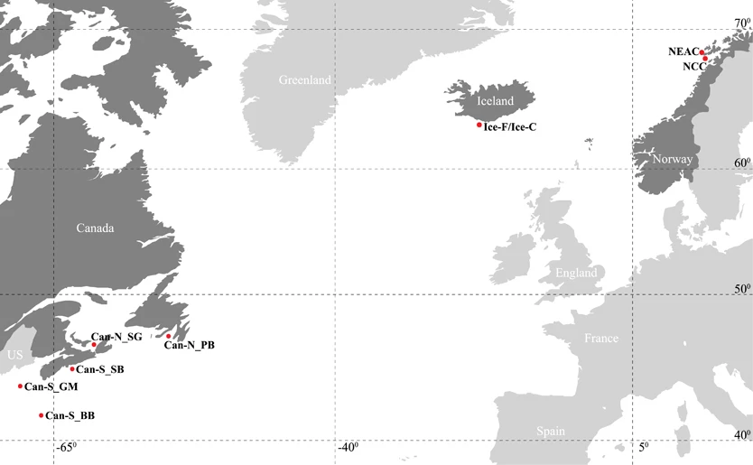

```{r setup, include=FALSE}
knitr::opts_chunk$set(echo = TRUE)
```

This week you're going to look for signals of selection across the genomes of Atlantic Cod, Gadus morhua. These data are from [Berg et al., 2017](http://dx.doi.org/10.1038/hdy.2017.54).

<center>

</center>


Within cod, there are two ecotypes related to migration, migratory and non-migratory. Migratory cod migrate from their adult habitat to their southern spawning grounds in the spring each year. Conversely, non-migratory cod largely spawn where they are without any significant migration. In terms of conservation implications, it is important to understand the genetic variation underlying such dramatic life-history divergence, particularly as changing environments begin to influence the migration patterns of these populations.  

<center>

</center>

---

The question is if there are genomic regions that distinguish migratory from non-migratory individuals. 

The data set consists of 316 individuals from 6 locations with 8,165 snps across all individuals.

|population|region|migration status|N|
|:---:|:---:|:---:|:---:|
|Ice_F|Iceland|migratory| 39|
|Ice_C|Iceland|non-migratory| 39|
|NEAC|Norway|migratory| 50|
|NCC|Norway|non-migratory| 44|
|Can-N|Canada|migratory?| 44|
|Can-S|Canada|non-migratory?| 44|


### Population structure

To quantify population structure, you'll use PCA. This should look familiar...

```{r eval=F}

library(adegenet)
library(ggplot2)

# read in your files. the file contains genotype information while the map file contains the information about the loci
obj <- read.PLINK(file="~/Documents/GEOMAR/Teaching/Mar_pop_gen/BergEtAl2017_AtlanticCod_TransatlanticDataset/BergEtAl2017_AtlanticCod_TransatlanticDataset.raw", map.file="~/Documents/GEOMAR/Teaching/Mar_pop_gen/BergEtAl2017_AtlanticCod_TransatlanticDataset/BergEtAl2017_AtlanticCod_TransatlanticDataset.map")

# pull out the population ids from the names of the individuals
population <- sapply(strsplit( indNames(obj),"-"), `[`, 1)
# the canada name formats are funny and need to be done differently.
canPop <- sapply(strsplit( indNames(obj),"_"), `[`, 1)

population[which(population == "Can")] <- canPop[which(population == "Can")]

#then name the populations in the adegenet object
pop(obj) <- population
# make your allele frequency table
x.af <- tab(obj, freq=TRUE, NA.method="mean")

# run PCA
pca.af <- dudi.pca(df = x.af, center = TRUE, # center by the mean
                   scale = FALSE, # don't scal/normalize,
                   scannf = FALSE, # don't show scree plot
                   nf = 10) # keep 10 pc's)


plot_data <- data.frame(individual = row.names(pca.af$li),
                        population = pop(obj),
                        PC1 = pca.af$li[,1],
                        PC2 = pca.af$li[,2]
)

ggplot(plot_data, aes(x=PC1, y=PC2, color=population, shape = population)) +
  geom_point(size=4) +
  theme_classic()

```


<style>
div.blue { background-color:#FFF3C0; border-radius: 5px; padding: 20px;}
</style>
<div class = "blue">

#### Question 6.1

Look at your PCA results. Do the results make sense? Is there isolation by distance? Explain the broad pattern you observe. 

</div>

### look for fst outliers

As I mentioned earlier, the study was interested in knowing if migratory and non-migratory populations were genetically divergent. 

To do this, you'll use outflank. What we can do with outFlank is define the groups so that the migratory individuals are one "population" and the non-migratory are another. Then we can look for regions of the genome that are divergent between the two groups.


```{r eval=F}
#############
# outflank

#library(devtools)
#source("http://bioconductor.org/biocLite.R")
#biocLite("qvalue")
#install_github("whitlock/OutFLANK")

library(OutFLANK)

# first, take your adegenet object from above and convert it to a matrix of allele frequencies.
snpmat <- as.matrix(obj)

# outFlank wants missing data to be 9. so we can replace the NA's with 9
snpmat <- replace(snpmat, is.na(snpmat), 9)

# Next make new population labels as migratory and non-migratory
population[population == "Ice_F"] <- ""
population[population == "Ice_C"] <- ""
population[population == "NEAC"] <- ""
population[population == "NCCC"] <- ""
population[population == "Can-N"] <- ""
population[population == "Can-S"] <- ""
# now calculate fst for all loci
# outflank has a command that will do this. All you need to do is feed it the SNP matrix, locus names, and population names. 
# out of this, you will get the Fst value between every snp between the two "populations"
FstDataFrame <- MakeDiploidFSTMat(SNPmat = snpmat, 
                        locusNames =list(colnames(snpmat)), 
                        popNames = list(population))

# look at results. first just at the distribution of fst values
hist(FstDataFrame$FST, breaks=30) 

# what we really want to see are the fst values along chromosomes. 
# we will make a manhattan plot. 

# in the simple sense, we could just plot each point sequentially. 
plot(x=seq(1, nrow(FstDataFrame)), y=FstDataFrame$FST, ylim=c(0,1))

# this works ok, but it doesn't tell us different chromosomes and is ugly
# Instead we can use the package qqman. to make a real manhattan plot
# qq man needs columns of names CHR, BP, SNP, containing the chromosome number, snp base positin, and SNP name. We will add these to the fst dataframe below

# read in the SNP data
snp_data <- read.table("~/Documents/GEOMAR/Teaching/Mar_pop_gen/BergEtAl2017_AtlanticCod_TransatlanticDataset/BergEtAl2017_AtlanticCod_TransatlanticDataset.map", header=F)

# add columns
FstDataFrame$CHR <- snp_data$V1
FstDataFrame$BP <- snp_data$V4
FstDataFrame$SNP <- snp_data$V3
library(qqman)

manhattan(FstDataFrame,
  p = "FST", logp = FALSE, ylab = "FST")  

```

<style>
div.blue { background-color:#FFF3C0; border-radius: 5px; padding: 20px;}
</style>
<div class = "blue">

#### Question 6.2

How many regions are likely under selection? On how many chromosomes? How can you tell?

</div>


### calculate statistical significance.

Like we discussed in lecture, outflank can be used to determine fst outliers. In out case here, it is pretty clear that the regions are significant. However, we will go through the steps so you can see it.

```{r eval=F}

# The following command will calculate outliers. 
# the main parameters to set:
  ## Left and right trim fraction. You can think of this as how much of the histogram do we think are outliers. In this case, the right tail is long, so we probably want to trim a good proportion of it. The left tail is not, so we can trim very little. 
  # Hmin is minimum heterozygosity- you can leave as is.
  # number of samples are the number of populations
  # qthreshold is the significance cutoff. qvalues are p-values that have been corrected for multiple testing.
OF <- OutFLANK(FstDataFrame,LeftTrimFraction=0.01,RightTrimFraction=0.2,
         Hmin=0.05,NumberOfSamples=2,qthreshold=0.05)
        
# now look at the fst distribution fit by OutFlank. 
## the yellow histogram are the actual data, the blue density plot is the inferred fit from OutFlank. Does it look reasonable?
OutFLANKResultsPlotter(OF,withOutliers=T,
                       NoCorr=T,Hmin=0.1,binwidth=0.005,
                       Zoom=F,RightZoomFraction=0.05,titletext=NULL)

#get the entries of significant outliers
outliers_OF <- OF$results[OF$results$OutlierFlag == TRUE,]

# then explore these.

# first look at the total number of outliers:
nrow(outliers_OF)

# where do they fall in the distribution of fst values?
hist(OF$results$FST, xlim=c(0,1), breaks=30)
hist(outliers_OF$FST, add =T, col="red")

# finally, let's mark these on the manhattan plot:
out_results <- OF$results
out_results$CHR <- snp_data$V1
out_results$BP <- snp_data$V4
out_results$SNP <- snp_data$V2

#change the q values of NA to 1
out_results$qvalues[is.na(out_results$qvalues)] <- 1

library(qqman)

manhattan(out_results,
  p = "FST", logp = FALSE, ylab = "FST",
  genomewideline = min(outliers_OF$FST),
  highlight = outliers_OF$LocusName)           
                                                            
```               

                                                                                      
<style>
div.blue { background-color:#FFF3C0; border-radius: 5px; padding: 20px;}
</style>
<div class = "blue">

#### Question 6.3

1. Look at the significant loci. Which of the regions do you find convincing as being under selection? Why

2. What would you change to plot the statistical significance instead of Fst? hint, it is best to use the -log10() of this value. Make this figure. Does it show the same result?

</div>                                                                                      


Congratulations! You just did a genome scan for selection!


### Inversion
One final fun thing. You notice that huge regions of chromosomes seem to be under selection but the rest of the genome is not very divergent. This suggests that there might be an inversion. 

One was to investigate an inversion is with a PCA. When there is a large inversion, you expect to see individuals fall out into three groups in PCA space. This is because there are three possible genotypes in the inversion; homozygous, heterozygous, homozygous. Let's look and see if this is the case. We will focus on chromosome 1


```{r eval=F}

# chr1 snps
chr1 <- snp_data$V2[which(snp_data$V1 == 1)]
chr1.af <- x.af[,colnames(x.af)%in% chr1]

pca.af <- dudi.pca(df = chr1.af, center = TRUE, # center by the mean
                   scale = FALSE, # don't scal/normalize,
                   scannf = FALSE, # don't show scree plot
                   nf = 10) # keep 5 pc's)


plot_data <- data.frame(individual = row.names(pca.af$li),
                        population = pop(obj),
                        PC1 = pca.af$li[,1],
                        PC2 = pca.af$li[,2]
)

ggplot(plot_data, aes(x=PC1, y=PC2, color=population, shape = population)) +
  geom_point(size=4) +
  theme_classic()


```

<style>
div.blue { background-color:#FFF3C0; border-radius: 5px; padding: 20px;}
</style>
<div class = "blue">

#### Question 6.4

1. Repeat this analysis for the other selected regions on other chromosomes. Is there evidence for an inversion in these other regions?

2. Also repeat the analysis for chromosomes that you think probably don't have an inversion. What differences do you see?

</div>   


